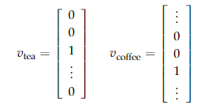
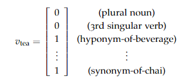
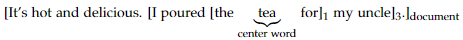
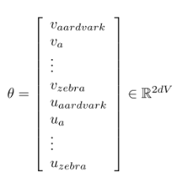
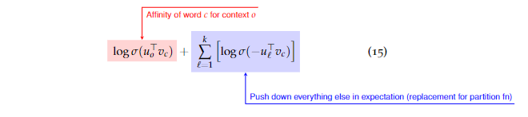

# Lecture 1 Word2Vec

## 1. NLP 

### 1.1 Language
- unique human intelligence 
- learnable & useful
- other modalities 

### 1.2 Language & Machines

1. Human
    - `sample efficiency` : few samples -> language ability
    - `compute efficiency` 

2. Representation
    - Tools provided by DL -> effective

### 1.3 NLP uses 
讨论了NLP一些可能的applications。

- translation
- QAs
- summarize / analysis
- speech2text 

- ... ...

NLP is facing challenges : dialects, bias, 可解释性 ... ... 

## 2. Representing Words 
这一章讨论了一些语言学的概念。

### 2.1 Signifier and signified

1. 考虑以下的两个句子 : 
    - Zuko makes the coffee for his uncle. 
    - Zuko makes the drink for his uncle.

    哪个更有可能与`tea`有关？第一句不可能有关，所以是第二句。

    -> Word meaning is endlessly complex.
        nuance change in language 导致 strong transfer of information

### 2.2 Independent words, independent vectors

1. 两个概念 : 
    - `type` : 词汇的要素
    - `token` : 某一type在context中的实例

    在使用中，我们选择一个词的某个type在context中使用。

2. **Vectors**

    - one-hot : 

        
    
        one-hot形式的编码并不能表征similarity，任意两项正交。
        $$ v_1^Tv_2 = v_2^Tv_1 = 0 $$

    one-hot编码是一个不包含任何信息量的表述，需要alternatives。

### 2.3 Vectors from annotated discrete properties

使用一系列的features来表征word semantics。

Example : 

这一类方法不work : always incomplete & tradeoff 

`allow data to determine more aspects`

## 3 Distributional semantics and Word2vec

本节的重点概念，也是modern NLP最重要的概念之一。

- DL : learn rich representations of complex objects from data.

- 在NLP中，上述概念的应用是:使用大量无监督的数据学习data的某种表征。

- 相同类型的词汇，其出现时周围词汇的分布也是类似的。

> You shall know a word by the company it keeps. 

### 3.1 Co-occurrence matrices and document contexts

- 一个最基础的实现思路。

    1. vocabulary V

    2. 初始化一个$|V|\times|V|$ 大小的矩阵。

    3. 遍历某一个document。 对某一个word $w$， 遍历其它所有word $w'$ 

    4. 矩阵每行归一化

 

通过以上的方法，就实现了一个ducument-level co-occurrence matrix。这样得到的词表示显然比one-hot方法有更大的信息量。而一个可能的实现思路是划分一个relevant window。
    

- short windows : 捕捉句法信息。
- large windows : 捕捉更多语义信息。

同时，直接使用count来作为频率是不恰当的，因为一些常见的词(the)的vec中，其它词汇的词频会非常大。 -> 使用 `log token frequency`

### 3.2 Word2Vec model and objective
正式介绍W2V的模型设计。

- W2V将词汇表示为一个低维度的向量。
- 使用2-4上下文学习词汇表示。

- Skipgram word2vec
    - 词汇表$V$, 记 $ C, O \in V$ 是两个词，且$C$是中心词，$O$是在$C$的上下文中的词。
    - 记 $U \in \R^{|V| \times d}$ , $V \in \R^{|V| \times d}$ ,每一个word都对应 $U/V$ 中的某一行。
    - 记 $u_w$ 表示词汇 $w$ 在 $U$ 中的表示，则有 : 

    $$ P_{U, V}(o|c) = exp (u_0^Tv_c) / \sum_{w \in V}exp(u_w^Tv_c) $$ 
 
    也即 : $C$ 的词汇表示中，$O$ 的概率等于 $C$ 表示为概率的softmax形式。-> 用内积来表征o,c之间的相似度。

    可以认为，Word2Vec训练的核心目标就是最大化中心词c和邻近词o之间的相似度。

- Word2Vec的核心思想 : 
    - 给定一长串的训练文本
    - 使用vector对文本进行表征
    - 给定一个中间词c，计算窗口内某个词o在给定c条件下的出现概率。
    - 最大化这个概率。

### 3.3 公式推导

- 那么，怎么训练这个model?

    minimize **cross-entropy loss** : 
    $$ min_{U, V} E_{o,c} [-logp_{U,V}(o|c)] $$

    使用参数矩阵U,V来最小化o,c的负log概率的期望。why?

    让我们推导一下：

    1. 需要最大化给定o，窗口内c的相似度。
    2. 记序列总长度为T，窗口长度为m，可以列出：
    $$ L(\theta) = \prod_{t=1}^T\prod_{-m\leq j \leq m}P(w_{t+j}|w_t;\theta)$$
    3. 需要优化 $\theta$ 以最大化 $L(\theta)$ 
    4. 转化为优化 $-logL(\theta)$，记为 $J(\theta)$，可以列式为：
    $$ J(\theta) = -\frac{1}{T}logL(\theta) = -\frac{1}{T}\sum_{t=1}{T}\sum_{-m \leq j \leq m} logP(w_{t+j}|w_t;\theta) $$
    5. 故最大化 $L$ 可以被转化为最小化 $J$，$J$ 就是训练的损失函数。

    -> 最大化似然等同于最小化损失。

    -> u表示word在上下文中时的表征，**v表示word作为中心词时的表征。**

下面正式推导模型的训练流程。

- 可以被优化的参数 : 

    

    使用梯度下降进行优化。
    
- 下面计算Loss function中某一项的导数。即计算$log(p(o|c))$对$v_c$的导数。

    1. 首先，已知 : 
        $$ p(o|c) = \frac{\exp(u_o^Tv_c)}{\sum_w \exp u_w^Tv_c}$$
    
    2. 对 $v_c$ 求导 : 
    
    $$ \frac{\partial}{\partial v_c} log\frac{\exp(u_o^Tv_c)}{\sum_w \exp u_w^Tv_c} \\
    = \frac{\partial}{\partial v_c} log\exp(u_o^Tv_c) - \frac{\partial}{\partial v_c} log{\sum_w \exp u_w^Tv_c} $$ 

    3. 首先计算左式 : 
    $$ \frac{\partial}{\partial v_c} log\exp(u_o^Tv_c) \\
    = \frac{\partial}{\partial v_c}(u_o^Tv_c) \\
    = u_o \\ 
    \text{可以直接约掉}$$ 

    4. 计算右式 : 
    $$ \frac{\partial}{\partial v_c} log{\sum_w \exp u_w^Tv_c} \quad \text{导数运算法则}\\
    =  \frac{1}{\sum_w \exp u_w^Tv_c} \cdot \frac{\partial}{\partial v_c} \sum_w \exp u_w^Tv_c \\
    = \frac{1}{\sum_w \exp u_w^Tv_c} \cdot \sum_x \frac{\partial}{\partial v_c} \exp u_x^Tv_c \quad \text{需要把w替换成x，以防止符号的冲突}\\
    = \frac{1}{\sum_w \exp u_w^Tv_c} \cdot \sum_x \exp u_x^Tv_c \frac{\partial}{\partial v_c} (u_x^Tv_c)\\ 
    = \frac{1}{\sum_w \exp u_w^Tv_c} \cdot \sum_x  \exp u_x^Tv_c \cdot u_x \\ 
    = \sum_x \frac{\exp u_x^Tv_c }{\sum_w \exp u_w^Tv_c} \cdot u_x \\
    = \sum_x p(x|c) u_x $$

    5. 故右式被转化为所有词汇相对于中心词汇c的概率期望。

    6. 代入原式，转化为：
    $$ u_o - \sum_x p(x|c) u_x $$

    7. 因此，求导的结果可以被视作 : 
    $$ observed - expected $$
     
    8. 对于 中心词 $C$， 窗口内某个词$O$，对$v_c$梯度反传的结果是：
    $$ v_c' = v_c - \alpha \cdot (-1) \cdot (u_o - \sum_x p(x|c) u_x) \\
    = v_c + \alpha \cdot (u_o - \sum_x p(x|c) u_x)$$

    9. 得到梯度反传的结果，此时p(o|c)增大，即c更像观察到的o。

### 3.4 Skipgram-negative-sampling 负采样
在得到的 $ p(o|c)$ 计算中，分母上的加法耗时很长。所以选择使用采样的方式。将在窗口内的正向优化，不在窗口内的反向优化。 

